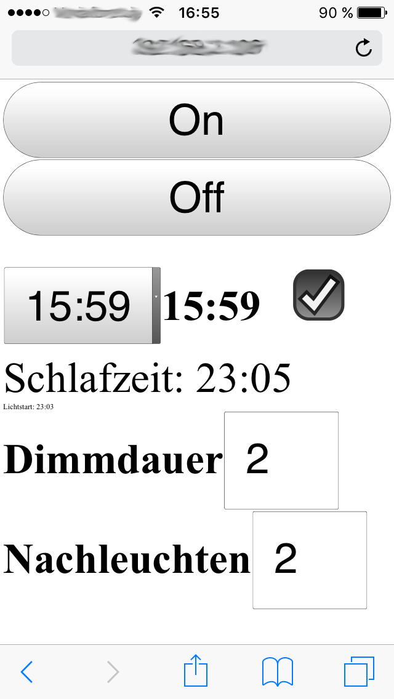

RaspberryPi Lichtwecker
=======================

Lichtwecker
------------
Zum aufwecken wird eine Gluehbirne langsam immer heller.


Umsetzung
------------
Ueber den RaspberryPi wird einen Weboberflaeche zur Verfuegung gestellt ueber die die Weckzeit (und andere Parameter) eingestellt werden kann.

Zum Dimmen wird ein Leistungssteller via PWM-Signal vom RaspberryPi angesteuert.

GPIO (on/off, pwm):
* http://abyz.co.uk/rpi/pigpio/pigpiod.html

Aktueller Stand der Dokumentation
------------------------------------
2015-12-12:

Python Skript (Backend - wecker_web.py) und JavaScript (Frontend static/main.js)

Diese Loesung ist ein erster Entwurf - die Implentierung ist noch sehr verbesserungsfaehig (-:


Screenshot
------------
Screenshot der Weboberflaeche auf einem iPhone 5:




Bemerkungen
---------------

####Webserver
Der Pythonwebserver ist manchmal nicht zugreifbar, geht aber wieder nachdem man sich via SSH auf dem PI angemeldet hat.
Viellicht ist das unter folgendem Link eine Loesung: https://wiki.archlinux.org/index.php/Systemd/User#Automatic_start-up_of_systemd_user_instances

####Tonwecker
Zusaetzlicher Ton zum Licht der langsam immer lauter wird:

omxplayer: http://elinux.org/Omxplayer
omxplayer Python: https://github.com/willprice/python-omxplayer-wrapper

Test mit omxplayer hat einwandrei funktioniert:
```bash
omxplayer test.mp3
```
